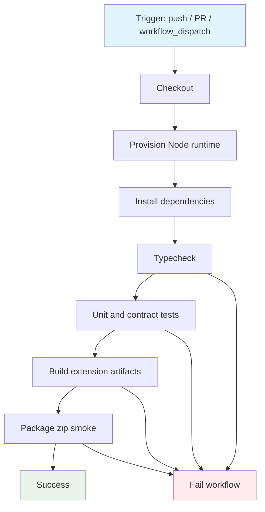

## Workflow Overview

**Purpose**: Validate every change with install, typecheck, unit/contract tests, and extension build (optional package smoke).
**Trigger Events**: Push to default branch; pull requests targeting default branch; manual dispatch.
**Target Environments**: Ephemeral Linux CI runners only (no deploy).

## Execution Flow Diagram



## Jobs & Dependencies

| Job Name | Purpose | Dependencies | Execution Context |
|----------|---------|--------------|-------------------|
| ci | Install, typecheck, test, build, package smoke | none | ubuntu-latest, Node 24 LTS (matches engines ≥24) |

## Requirements Matrix

### Functional Requirements

| ID | Requirement | Priority | Acceptance Criteria |
|----|-------------|----------|---------------------|
| REQ-001 | Reproducible dependency install | High | Lockfile-based install exits 0 |
| REQ-002 | Static TypeScript check | High | Project typecheck command exits 0 |
| REQ-003 | Automated test suite | High | Project test command exits 0; all unit/contract tests pass |
| REQ-004 | Extension build | High | Project build produces `dist/` including manifest + content classic script |
| REQ-005 | Package smoke | Medium | Project package produces zip under `artifacts/` when zip tooling present |
| REQ-006 | PR and main coverage | High | Runs on PRs to main and pushes to main |

### Security Requirements

| ID | Requirement | Implementation Constraint |
|----|-------------|---------------------------|
| SEC-001 | Least privilege | Workflow permissions limited to read contents; no write tokens |
| SEC-002 | No secrets required for CI gates | Do not inject API keys, OAuth, or Bungie credentials |
| SEC-003 | Dependency integrity | Prefer lockfile install over free-floating resolves |

### Performance Requirements

| ID | Metric | Target | Measurement Method |
|----|--------|--------|--------------------|
| PERF-001 | Full CI duration | ≤ 10 minutes typical | GitHub Actions job duration |
| PERF-002 | Concurrency | Cancel superseded PR runs | Concurrency group per ref |

## Input/Output Contracts

### Inputs

```yaml
# Environment Variables
NODE_VERSION: string  # Purpose: major Node version meeting package engines (≥24); CI pins 24 LTS

# Repository Triggers
paths: []  # all paths (extension is small; full suite always)
branches: [main]
events: [push, pull_request, workflow_dispatch]
```

### Outputs

```yaml
# Artifacts (optional retention)
dist_tree: directory  # Built extension under dist/
package_zip: file     # artifacts/vault-keeper.zip when package step runs
```

### Secrets & Variables

| Type | Name | Purpose | Scope |
|------|------|---------|-------|
| — | none | CI gates need no secrets | — |

## Execution Constraints

### Runtime Constraints

- **Timeout**: 15 minutes per job
- **Concurrency**: One active run per workflow+ref; cancel in-progress on newer commits
- **Resource Limits**: Default GitHub-hosted runner

### Environmental Constraints

- **Runner Requirements**: Linux x64 with network for registry install
- **Network Access**: npm registry only
- **Permissions**: `contents: read`

## Error Handling Strategy

| Error Type | Response | Recovery Action |
|------------|----------|-----------------|
| Install failure | Fail job | Fix lockfile / engines; re-run |
| Typecheck failure | Fail job | Fix types locally; re-run |
| Test failure | Fail job | Fix tests or product; re-run |
| Build failure | Fail job | Fix build scripts/bundle; re-run |
| Package failure | Fail job | Ensure zip CLI / package script; re-run |

## Quality Gates

### Gate Definitions

| Gate | Criteria | Bypass Conditions |
|------|----------|-------------------|
| Typecheck | Exit 0 | None |
| Tests | Exit 0, all tests pass | None |
| Build | Exit 0, dist present | None |
| Package smoke | Exit 0, zip present | None (required when step is in workflow) |

## Monitoring & Observability

### Key Metrics

- **Success Rate**: All gates green on main
- **Execution Time**: Track job duration in Actions UI
- **Resource Usage**: Default runner metrics

### Alerting

| Condition | Severity | Notification Target |
|-----------|----------|---------------------|
| CI red on main | High | PR author / maintainers via GitHub Checks |
| Flaky test (intermittent fail) | Medium | Treat as product defect until green×2 locally |

## Integration Points

### External Systems

| System | Integration Type | Data Exchange | SLA Requirements |
|--------|------------------|---------------|------------------|
| npm registry | HTTPS install | package-lock | Best-effort public registry |
| GitHub Checks | Status reporting | pass/fail | Blocks merge if branch protection enabled |

### Dependent Workflows

| Workflow | Relationship | Trigger Mechanism |
|----------|--------------|-------------------|
| none | — | — |

## Compliance & Governance

### Audit Requirements

- **Execution Logs**: GitHub Actions retention default
- **Approval Gates**: Branch protection optional (org policy)
- **Change Control**: Update this spec before material CI behavior changes

### Security Controls

- **Access Control**: Repo write required to change workflow
- **Secret Management**: N/A for default CI
- **Vulnerability Scanning**: Out of scope for this workflow

## Edge Cases & Exceptions

### Scenario Matrix

| Scenario | Expected Behavior | Validation Method |
|----------|-------------------|-------------------|
| PR from fork | Runs without secrets; same gates | Open fork PR |
| Only docs change | Full suite still runs (small repo) | Push docs-only PR |
| Node engines bump | Update NODE_VERSION and engines together | Spec + package.json review |
| Live DIM unavailable | CI does not require browser/DIM | Unit/contract only |

## Validation Criteria

### Workflow Validation

- **VLD-001**: Fresh clone + workflow steps reproduce local `npm ci && npm run typecheck && npm test && npm run build && npm run package`
- **VLD-002**: Failed typecheck/test/build marks check failed
- **VLD-003**: No workflow step requires Firefox, DIM, or API keys

### Performance Benchmarks

- **PERF-001**: Green run typically under 10 minutes
- **PERF-002**: Superseded PR runs cancelled

## Change Management

### Update Process

1. **Specification Update**: Modify this document first
2. **Review & Approval**: PR review
3. **Implementation**: Align `.github/workflows/ci.yml`
4. **Testing**: Push branch; confirm Checks green
5. **Deployment**: Merge to main

### Version History

| Version | Date | Changes | Author |
|---------|------|---------|--------|
| 1.0 | 2026-07-13 | Initial CI gates: install, typecheck, test, build, package | Agent |
| 1.1 | 2026-07-13 | Node pin 24 LTS; engines ≥24; toolchain TS 7 / Vitest 4 | Agent |

## Related Specifications

- [`docs/packaging.md`](../docs/packaging.md) — local package / temporary add-on load
- [`docs/manual-qa.md`](../docs/manual-qa.md) — live DIM checklist (not CI)
- Project `package.json` scripts: `typecheck`, `test`, `build`, `package`
